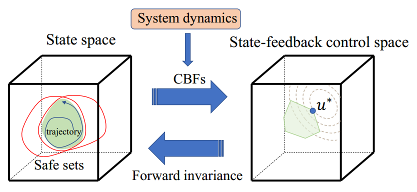

# High Order Control Barrier Functions (HOCBFs)

Lyapunov methods for safety-critical control theory (in Matlab)

 


There are two simple demos using HOCBFs: Adaptive Cruise Control and Robot Control.


If you find this helpful, please cite our work:
```
@article{xiao2021high,
  title={High-order control barrier functions},
  author={Xiao, Wei and Belta, Calin},
  journal={IEEE Transactions on Automatic Control},
  volume={67},
  number={7},
  pages={3655--3662},
  year={2021},
  publisher={IEEE}
}
```
```
@inproceedings{xiao2019control,
  title={Control barrier functions for systems with high relative degree},
  author={Xiao, Wei and Belta, Calin},
  booktitle={2019 IEEE 58th conference on decision and control (CDC)},
  pages={474--479},
  year={2019},
  organization={IEEE}
}
```